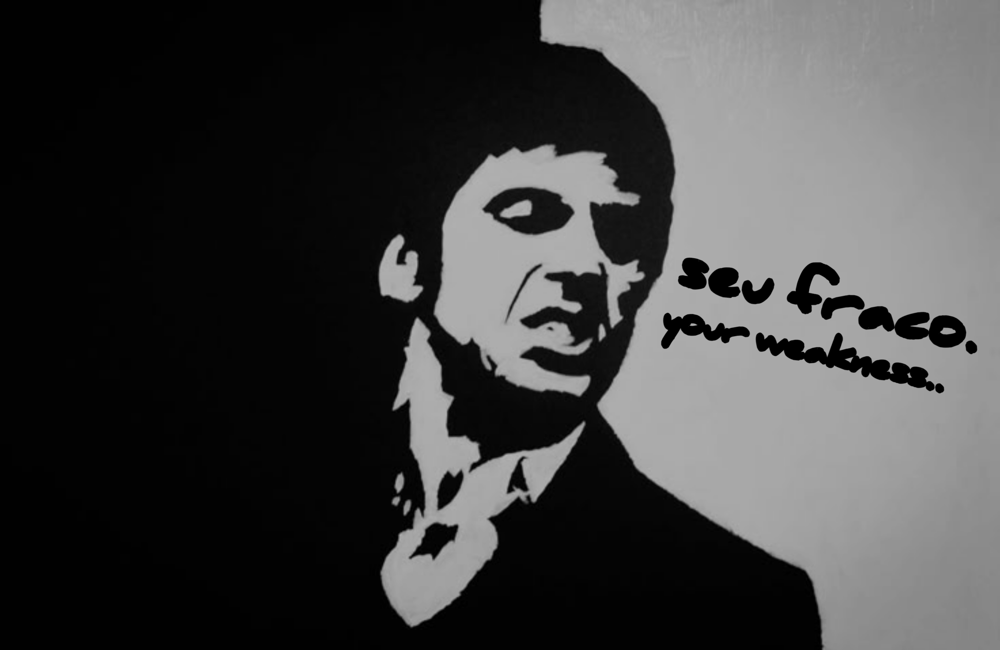

<h1 align="center">semana que vem o edito estou ocupado no momento</h1>
<h3 align="center"></h3>

<h1 align="center"></h1>
<h1 align="center">link</h1>
<h3 align="center">https://gabriel0kumura.github.io/</h3>
<h1 align="center"></h1>
